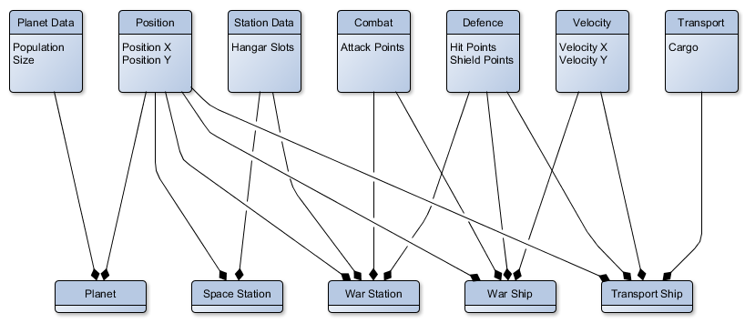

# mogi

## ECS (breakdown)

An ECS (Entity Component System) operates by having arrays of entities, each of which are composed of components, each of which operate on their own system.
Entities contain components which contain data. It is then up to the systems (each of which have their own update/draw loops), to do something with that data. A rendering component may contain the file for an image, but it is up to the rendering system to then paint it to the surface (of which there is only one in mogi lolz).


## ENTITIES

New entity demo: (in app folder there should be a more in depth example)

```java
ecs.manager world = new ecs.manager();
entity plane = new entity();

plane.addComponent(new transformComponent(50, 50));
plane.addComponent(new renderComponent("app/plane.png"));

world.addEntity(plane);
```

## TRANSFORM:

Add transform component to your entity like so:
```java
bullet.addComponent(new transformComponent(int x, int y, float radians (overload)));
```

Required for most other systems. Position is uniform throughout entity, unless specifically stated all other systems will inherit from transform (with offsets etc. if applicable)
No system.


## RENDERING:

Add rendering component to your entity like so:

```java
entity.addComponent(new renderComponent(String filePath));
```

The file path should point to an image that java is able to parse into a [Buffered Image](https://docs.oracle.com/javase/8/docs/api/java/awt/image/BufferedImage.html) (PEG, PNG, BMP, WEBMP, GIF). The render system requires a transform component to be added.
Rendering system, renders the images.


## COLLISION:

Add collider component to your entity like so:

```java
entity.addComponent(new colliderComponent(int width, int height, int offsetx (overload), int offsety (overload)));
```

Check for collision:
```java
if(entity.isColliding){
    // colliding with anything
}

if(AABBisColliding(entity A, entity B)){
    // A and B are colliding
}

if(AABBisColliding(String tagA, String tagB)){
    // Entity with tagA is colliding with entity 
}
```

Collision system, checks collisions and provides functions.

### ROTATING Axis Aligned Bounding Boxes COLLISION BREAKDOWN

Quick unadded feature that is useful for many games so I'll write a quick theory breakdown here:

+ how to collide rectangles at any angle
+ no longer rectangle, they are 4 lines
+ find equation of each line for each rectangle (albeta math 10 time)
+ find intersection points of all lines
+ if intersection point is within the bounds of one of the rectangles, they are colliding

code is in collider system, but doesn't work and so is not used in any demos

